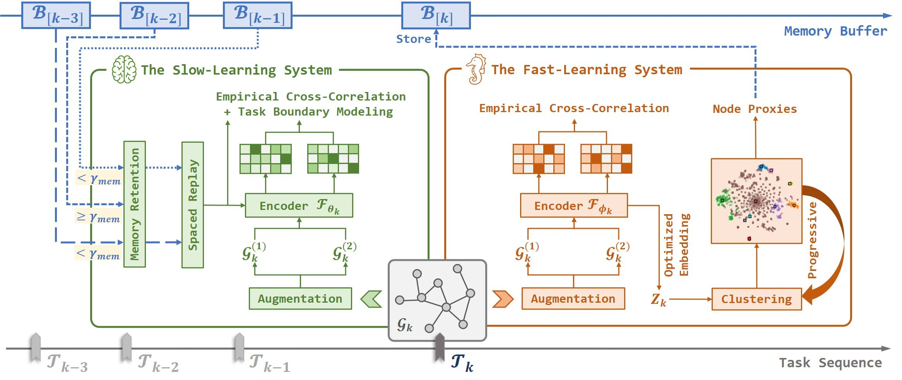

# TRACE 
Self-Supervised Continual Graph Learning via Adaptive Spaced Replay on Node Proxies (Peng Z, Hua X, Hao J, *et al.*, KDD 2025): [https://dl.acm.org/doi/abs/10.1145/3711896.3737121](https://dl.acm.org/doi/abs/10.1145/3711896.3737121)

 

## Overview
Here we provide a toy example of the TRACE model with slight improvements (under the task-IL setting), and display the code in an easy-to-read form. To better understand the code, we recommend that you could read the code of pbielak/graph-barlow-twins (https://github.com/pbielak/graph-barlow-twins) in advance. You could further optimize the code based on your own needs. The repository is organized as follows:

- `data/` includes an example dataset (no_inter_task_edge version), more datasets are available at https://github.com/QueuQ/CGLB;
- `models/` mainly contains the implementation of the TRACE pipeline (`model.py`) and the GNN model (`gnns.py`);
- `task_node_proxy.py` implements progressive clustering to select representative node proxies;
- `utils.py` contains the necessary processing tool.

## Requirements  

  * Python  3.7.10
  * PyTorch  1.13.0
  * torch-scatter  2.1.1+pt113cu116
  * torch-sparse  0.6.17+pt113cu116
  * dgl-cu101  0.6.1
  * networkx  2.5
  * numpy  1.21.6
  * scipy  1.5.2

## Usage

```python run_taskCL.py```

## Cite
Please cite our paper if you make advantage of TRACE in your research:

```
@inproceedings{peng2025self,
  title={Self-Supervised Continual Graph Learning via Adaptive Spaced Replay on Node Proxies},
  author={Peng, Zhen and Hua, Xu and Hao, Jingchen and Lin, Qika and Dong, Bo and Shen, Chao},
  booktitle={Proceedings of the 31st ACM SIGKDD Conference on Knowledge Discovery and Data Mining V. 2},
  pages={2303--2314},
  year={2025}
}

```
